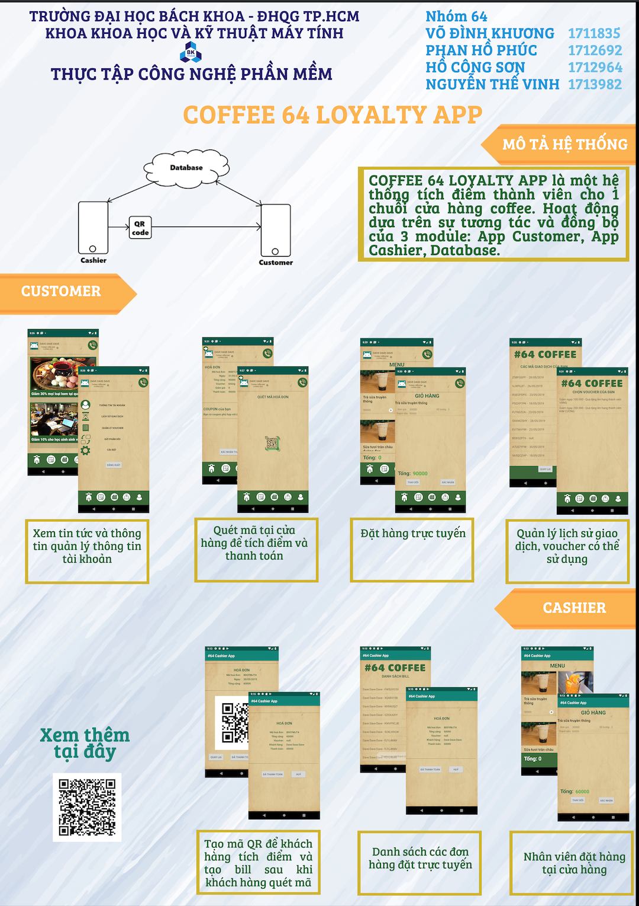

<h2 style="background-color: white;">

GIỚI THIỆU APP THE 64 COFFEE&nbsp;

 

Hôm nay, ngày 1/6/2019 App The 64 COFFEE đã chính thức được ra mắt! 
Với sự đam mê và nhiệt huyết nhóm sinh viên chúng mình đã hoàn thành ứng dụng đầu tiên của nhóm sau hơn 3 tháng phát triển! 
Thay mặt những thành viên trong nhóm:&nbsp;Võ Đình Khương -&nbsp;Hồ Công Sơn&nbsp;- Phan Hồ Phúc - Nguyễn Thế Vinh. 
Mình xin chân thành cảm ơn thầy và các bạn đã ủng hộ và góp ý cho dự án đầu tay của chúng mình.&nbsp; 
<i>- Hồ Công Sơn -</i> 
 
Sau đây hãy cùng mình khám phá phiên bản chính thức đầu tiên của dự án nhé! 
 
Dự án của chúng mình đó là viết ứng dụng cho chuỗi cửa hàng cà phê, trà sữa,... Bao gồm 1 app dành cho cửa hàng và 1 app dành cho khách hàng. 
App dành cho cửa hàng sẽ giúp thu ngân dễ dàng tạo hóa đơn và chuyển chúng thành mã QR code. 
Khách hàng sẽ quét mã QR code đó để thanh toán hóa đơn đồng thời tích điểm. Và với lượng điểm nhất định bạn sẽ thăng hạng và nhận những voucher vô cùng hấp dẫn ^^ Xem chi tiết về Hạng thành viên và phần thưởng tích điểm tại đây: 
<a href="https://the64coffee.blogspot.com/2019/05/thong-tin-tich-iem.html">https://the64coffee.blogspot.com/2019/05/thong-tin-tich-iem.html</a> 
 
CUSTOMER APP 
Bây giời mình sẽ giới thiệu cho các bạn ứng dụng dành cho khách hàng. 
 
... sắp cập nhật!

 
 

_________________________________________________________

Xem thêm thông tin về 64 COFFEE tại:

<a href="https://the64coffee.blogspot.com/">https://the64coffee.blogspot.com/</a>

_________________________________________________________

 

Design by Group 64

Software Engineering | HCMUT 
 
 

 

Lưu ý: Đây không phải là cửa hàng thật. Đây là một dự án của nhóm 64, bộ môn thực tập Công nghệ phần mềm học kỳ 182 của trường đại học Bách Khoa T.P Hồ Chí Minh.

Mọi thắc mắc, góp ý hoặc đề nghị hợp tác xin liên hệ email: son.hocongson99@hcmut.edu.vn&nbsp;

Xin cảm ơn!

</h2>

